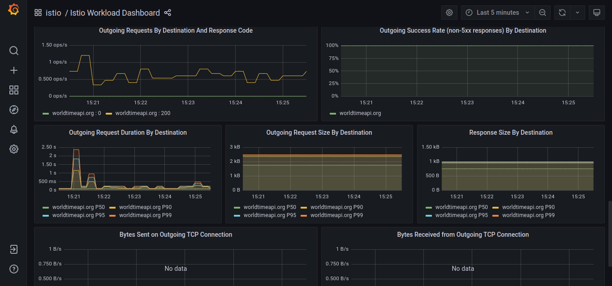
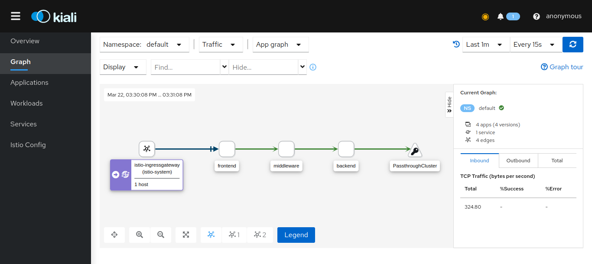

## Istio on a kubernetes cluster with tracing and monitoring

### Steps to run

1. Create a local kind cluster with `kind create cluster`
2. Install [istioctl] cli(https://istio.io/latest/docs/setup/getting-started/#download)
3. Install istio into kubernetes cluster `istioctl install --set profile=demo`
4. Auto inject envoy sidecars to workloads in the default namespace `kubectl label namespace default istio-injection=enabled`
5. Deploy using [skaffold](https://skaffold.dev) to the cluster

### View the app in browser

- Run `kubectl get -n istio-system svc/istio-ingressgateway -o=jsonpath='{.status.loadBalancer.ingress[0].ip}'` to get the loadbalancer ip
- Access the app by going to the ip address from previous step in your browser

### Monitoring with grafana

- Run `kubectl port-forward -n istio-system svc/grafana 3001:3000`
- View grafana dashboard on [http://localhost:3001](http://localhost:3001)

### Distributed tracing with Kiali

- Run `kubectl port-forward -n istio-system svc/kiali 3002:20001`
- View kiali dashboard on [http://localhost:3002](http://localhost:3002)

